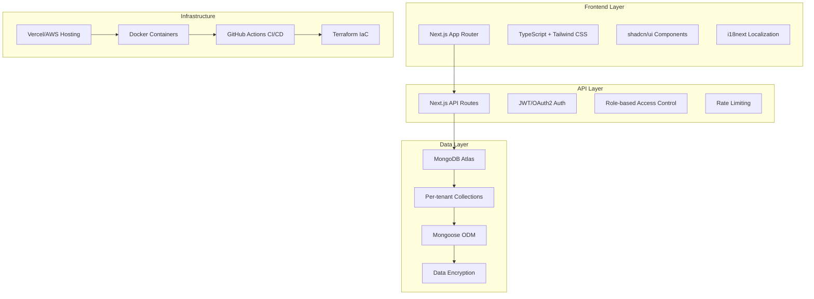

# RealEstatePro CRM - Executive Overview

## Project Vision

RealEstatePro CRM is a cloud-native, multi-tenant SaaS platform designed to streamline every aspect of real-estate operations for building owners, their staff, and tenants. The platform empowers organizations to manage multiple buildings, handle tenant relationships, and optimize operational workflows through role-based access and comprehensive automation.

## Key Business Goals

- **Multi-Tenancy**: Strict data isolation with per-tenant theming (logo, color palettes, custom domains)
- **Scalability & Performance**: Support thousands of buildings and concurrent users with sub-second response times
- **Localization & Compliance**: Dual-language (English + Arabic RTL) from Day 1; UAE-compliant formats
- **Security & Auditing**: Role-based access control, JWT/OAuth2 authentication, encrypted data at rest
- **Extensibility**: Modular architecture enabling rapid addition of new features

## User Personas & Workflows

### Super Admin
- Onboard property-management clients, assign Billing Plans
- Create sub-Super Admins or grant view/edit/delete scopes per tenant
- Monitor usage metrics, system health, and generate enterprise reports

### Building Admin
- Define building profiles & flat inventory (bulk CSV import)
- Approve new tenants, assign unit contracts
- Oversee complaint approvals, maintenance assignments, and SLA tracking

### Receptionist / Guard
- Register walk-in visitors: capture ID, contact, intended flat
- Trigger automated alerts to Sales and Building Admin

### Sales Team
- View visitor leads with follow-up reminders
- Log communications (phone, email, WhatsApp), update lead status
- Convert qualified leads to tenant applications

### Maintenance Team
- Receive approved tickets, view flat location and priority
- Update progress, upload photos, and mark as resolved

### Tenant
- Access contract documents, download payment receipts
- Submit and track complaints with category, description, and attachments
- Receive community announcements and building-specific alerts

## Architecture Overview

## Technology Stack

### Frontend
- Next.js 14 (App Router) with TypeScript
- Tailwind CSS + shadcn/ui component library
- lucide-react icons, react-hook-form, swr/react-query
- i18next for EN/AR localization (RTL support)
- date-fns for locale formatting

### Backend
- Next.js API Routes with TypeScript
- MongoDB with Mongoose ODM, per-tenant collections
- NextAuth.js for authentication
- Swagger/OpenAPI documentation

### Infrastructure & DevOps
- Terraform modules for MongoDB Atlas, Vercel/AWS hosting
- Docker-compose for local Dev/UAT parity
- GitHub Actions: CI (lint, type-check, test), CD to UAT/Prod
- Winston logging with rotating file transports

### Quality & Security
- ESLint + Prettier + Husky + lint-staged
- OWASP top-10 mitigations, CORS, rate-limiting middleware
- Automated vulnerability scans in CI

## Development Workflow

### Agile Sprints
- **Sprint Length**: 2 weeks
- **Environments**: Dev → UAT → Production
- **Artifact Cadence**: Each sprint delivers code scaffold, UI mockups, API docs, and CI/CD updates

### Version Control & Branch Strategy
- `main` → production
- `uat` → user-acceptance testing
- `develop` → integration
- `feature/{module-name}` → isolated feature work

## Security & Compliance

- **Data Isolation**: Strict multi-tenant data separation
- **Authentication**: JWT/OAuth2 with refresh token rotation
- **Authorization**: Role-based access control (RBAC)
- **Audit Trail**: Comprehensive action logging for compliance
- **Encryption**: Data encrypted at rest and in transit
- **GDPR/KYC**: Built-in hooks for regulatory compliance 